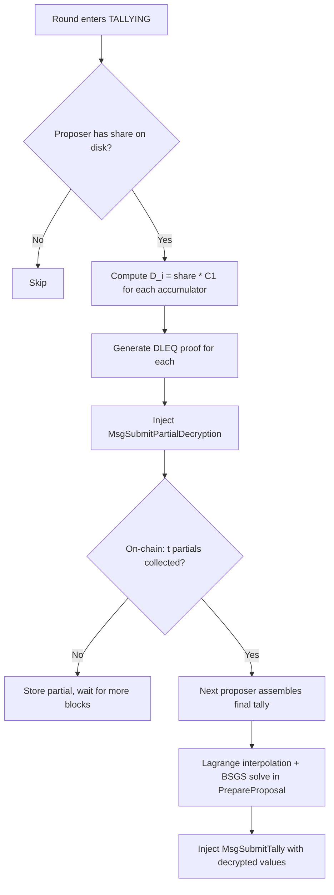

# Threshold Decryption for the EA Key Ceremony

## Goal

Prevent any single party (including the dealer) from decrypting individual votes. Only the aggregate tally should be recoverable, and only with cooperation of at least t = n/3 + 1 validators.

## Phase 1: Dealer Shamir Shares (Stepping Stone)

The dealer still generates `ea_sk`, but distributes **(t, n) Shamir shares** instead of the full key. No single non-dealer validator can decrypt. Builds all the crypto primitives reused in Phase 2.

### 1.1 New Crypto Primitives

Create `sdk/crypto/shamir/` package:

- `**shamir.go`** — Shamir secret sharing over Pallas Fq
  - `Split(secret Scalar, t, n int) -> []Share` — evaluate random degree-(t-1) polynomial at points 1..n
  - `LagrangeCoefficients(indices []int, target int) -> []Scalar` — compute Lagrange basis at a target point (0 for reconstruction)
  - `Reconstruct(shares []Share, t int) -> Scalar` — recover the secret (used only in tests to verify correctness)
- `**feldman.go**` — Feldman verifiable commitments
  - `FeldmanCommit(coefficients []Scalar) -> []Point` — publish `[a_0*G, a_1*G, ..., a_{t-1}*G]`
  - `FeldmanVerify(commitments []Point, index int, share Scalar) -> bool` — check `share * G == sum(C_j * index^j)`
  - Verification keys: `VK_i = sum(C_j * i^j)` derivable from commitments (no extra storage)
- `**partial_decrypt.go**` — Threshold ElGamal decryption
  - `PartialDecrypt(share Scalar, C1 Point) -> Point` — compute `D_i = share * C1`
  - `CombinePartials(partials []Point, indices []int) -> Point` — Lagrange interpolation in the exponent: `sum(lambda_i * D_i)`
  - DLEQ proof: prove `log_G(VK_i) == log_{C1}(D_i)` — reuse existing [sdk/crypto/elgamal/dleq.go](sdk/crypto/elgamal/dleq.go) pattern

### 1.2 Ceremony Changes

**Deal phase** — modify [sdk/app/prepare_proposal_ceremony.go](sdk/app/prepare_proposal_ceremony.go):

```
Current:  generate ea_sk → ECIES(ea_sk, pk_i) for each validator
New:      generate ea_sk → polynomial f(x) with f(0)=ea_sk
          → ECIES(f(i), pk_i) for each validator
          → Feldman commitments [a_0*G, ..., a_{t-1}*G]
```

- `MsgDealExecutiveAuthorityKey` gains a `feldman_commitments` field (repeated bytes, each 32-byte compressed Pallas point)
- The dealer writes their own share `f(dealer_index)` to disk (not `ea_sk`)

**Ack phase** — modify [sdk/x/vote/keeper/msg_server_ceremony.go](sdk/x/vote/keeper/msg_server_ceremony.go):

```
Current:  decrypt ECIES → get ea_sk → verify ea_sk * G == ea_pk → ack
New:      decrypt ECIES → get share_i → verify against Feldman commitments → ack
```

- Each validator verifies: `share_i * G == sum(C_j * i^j)` using on-chain Feldman commitments
- Each validator writes `share_i` to disk (replaces `ea_sk` file)

**On-chain state** — modify `VoteRound` protobuf:

- Add `repeated bytes feldman_commitments` field
- Add `uint32 threshold` field (t value, defaults to `ceil(n/3) + 1` if 0)
- `ea_pk` is now derivable as `feldman_commitments[0]` (the constant term commitment), but keep explicit for backward compat

### 1.3 Tally Changes

This is the biggest structural change. Currently one proposer decrypts everything. Now:

**New message: `MsgSubmitPartialDecryption`**

```protobuf
message MsgSubmitPartialDecryption {
  bytes  vote_round_id    = 1;
  string creator          = 2;  // validator operator address
  uint32 validator_index  = 3;  // index in ceremony_validators (1-based, matches Shamir eval point)
  repeated PartialDecryptionEntry entries = 4;
}

message PartialDecryptionEntry {
  uint32 proposal_id     = 1;
  uint32 vote_decision   = 2;
  bytes  partial_decrypt  = 3;  // 32 bytes: D_i = share_i * C1
  bytes  dleq_proof       = 4;  // proves log_G(VK_i) == log_{C1}(D_i)
}
```

**PrepareProposal flow** (new injector, replaces current tally injector):




**On-chain partial decryption storage** (new KV prefix):

- Key: `0x10 || round_id || validator_index` -> `PartialDecryptionEntry[]` protobuf
- The chain verifies each DLEQ proof against `VK_i` (derived from Feldman commitments) before storing

**MsgSubmitTally changes:**

- Currently: proposer decrypts locally, submits plaintext + DLEQ proof per accumulator
- New: proposer reads t partial decryptions from KV, performs Lagrange interpolation in the exponent locally, runs BSGS, submits plaintext values
- Verification: on-chain recombines the stored partials using Lagrange interpolation, checks `C2 - combined_partial == totalValue * G`

### 1.4 File Change Summary


| File                                       | Change                                                                                |
| ------------------------------------------ | ------------------------------------------------------------------------------------- |
| `sdk/crypto/shamir/` (new)                 | Shamir splitting, Feldman commitments, partial decryption, Lagrange                   |
| `sdk/proto/zvote/v1/tx.proto`              | Add `MsgSubmitPartialDecryption`, add `feldman_commitments` + `threshold` to deal msg |
| `sdk/app/prepare_proposal_ceremony.go`     | Deal: polynomial split + Feldman commitments instead of raw ea_sk                     |
| `sdk/app/prepare_proposal.go`              | Tally: partial decryption injection + final tally assembly                            |
| `sdk/x/vote/keeper/msg_server_ceremony.go` | Ack: verify share against Feldman commitments                                         |
| `sdk/x/vote/keeper/msg_server.go`          | New handler for `MsgSubmitPartialDecryption`, modified `SubmitTally` verification     |
| `sdk/x/vote/keeper/keeper.go`              | KV accessors for partial decryption storage                                           |
| `sdk/x/vote/types/keys.go`                 | New KV prefix for partial decryptions                                                 |
| `sdk/README.md`                            | Updated ceremony and tally documentation                                              |


### 1.5 What Phase 1 Does NOT Solve

The dealer still generates `ea_sk` in memory before splitting it into shares. A malicious dealer who saves `ea_sk` can decrypt individual votes. Phase 2 eliminates this.

---

## Phase 2: Pedersen DKG (Future — Eliminates Trusted Dealer)

Upgrade the ceremony so that **no single party ever knows `ea_sk`**. The tally pipeline from Phase 1 is reused unchanged.

### 2.1 Ceremony State Machine Change

```
Phase 1: REGISTERING --> DEALT --> CONFIRMED
Phase 2: REGISTERING --> COMMITTING --> SHARING --> CONFIRMED
```

- **COMMITTING**: Each validator generates their own degree-(t-1) polynomial `f_i(x)`, publishes Feldman commitments `[a_{i,0}*G, ..., a_{i,t-1}*G]` via a new `MsgCommitPolynomial`
- **SHARING**: Each validator distributes `ECIES(f_i(j), pk_j)` to all others via `MsgDistributeShares`. Each recipient verifies against committed Feldman values and acks.
- **CONFIRMED**: Each validator computes `sk_share_i = sum_j(f_j(i))`. The combined public key is `ea_pk = sum_j(C_{j,0})`.

### 2.2 What Changes from Phase 1

- Ceremony gains one additional round (COMMITTING before SHARING)
- `MsgDealExecutiveAuthorityKey` is replaced by `MsgCommitPolynomial` + `MsgDistributeShares`
- The dealer role disappears — all validators are equal contributors
- **Tally pipeline is identical** — partial decryptions, Lagrange interpolation, BSGS, same verification

### 2.3 New Crypto Required

None — all primitives (Shamir, Feldman, partial decryption, Lagrange, DLEQ) are built in Phase 1. The only new work is the ceremony state machine and message handlers.

---

## Security Properties Summary


| Property                                | Current                    | Phase 1                            | Phase 2          |
| --------------------------------------- | -------------------------- | ---------------------------------- | ---------------- |
| Dealer knows ea_sk                      | Yes (every validator does) | Yes (dealer only)                  | No dealer exists |
| Single non-dealer validator can decrypt | Yes                        | No                                 | No               |
| t colluding non-dealers can decrypt     | Yes                        | No (need t shares + recombination) | No               |
| Threshold for tally                     | 1 (any validator)          | t = n/3 + 1                        | t = n/3 + 1      |
| Liveness for tally                      | 1 validator                | t validators                       | t validators     |


